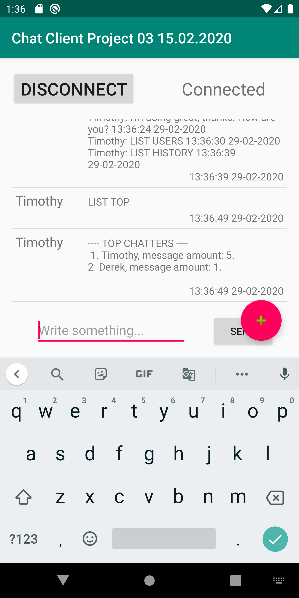

# TCP Chat Server and Client in Android Studio
TCP Chat server and client created in IntelliJ and Android Studio and programmed with Kotlin.
Project uses Socket objects to provide a connection to the server and create a connection for the Android client. Kotlinx serialization libraries are implemented to serialize ChatMessage objects between server and client.

### Prerequisities
To download and and use the software you need: 
<ul>
  <li>Computer</li>
  <li>Internet connection</li>
  <li>Android Studio</li>
  <li>IntelliJ software (I used community edition, which is FREE!)</li>
</ul>
 
###  Usage
Explanation on how to run and build the Chat client mobile application and how
TCP/IP protocol is used to establish a connection and communicate with server and client.

<b>Show instructions</b>

1. Download or clone this GitHub repository.

2. Open the Client folder in Android Studio (3.5.3v at the time of writing this) 

3. Open the Server folder in IntelliJ (2019.3.3 at the time of writing this) 

#### How to run server and client and compile client app into an APK file.

* <b> Running server in IntelliJ. </b>
To run the server press the 'Run' button or use shortcut Ctrl + Shift + F10 (on Windows or Linux).

  

* <b> Stopping the server. </b>
To stop the server you can similiarily press the 'Stop' button.

  

* <b> Running client in Android Studio. </b>
To run the client press the 'Run' button or use shortcut Ctrl + Shift + F10 (on Windows or Linux).
Both IDEs are built from the same code, thus they both have the same functionality.

  

* <b> Stopping client emulation in Android Studio. </b>
To stop the client you can similiarily press the 'Stop' button.

  

* <b> Building project. </b>
Builds an APK of all modules in the current project for their selected variant. When IDE finishes building, a confirmation notification appears, providing a link to the APK file. The path to file is in <i><b>Chat Client Android Studio/app/build/outputs/apk/debug/</b></i> and default file name is app-debug.apk

  

<b>How to establish a connection to server.</b>

1. Server socket is bound to a port and uses the assigned IP address. For this example we can use private address '192.168.1.10' and port '9999'.
  
  
2. In chat client a connection is established by using the above address and port. 

### Automation testing
Not implemented :( 

### Application screenshots
Images of how the application looks.

<b>Screenshots</b>

  
  
  
  
  
   
   
  

### Change log
See CHANGELOG [here](CHANGELOG.md)
